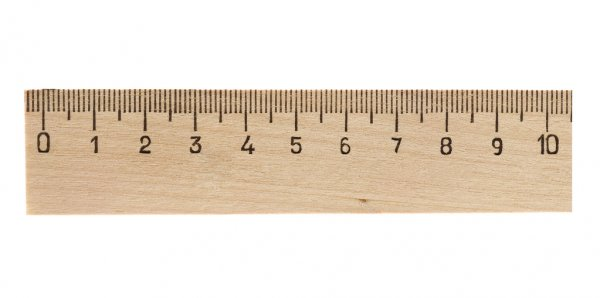

# Conditions and loops

## Write functions for working with conditions and loops

## Before we start

1. This practical task is verified automatically with tests. 
2. Please, put all your `JavaScript` code in the `src/script.js` and `HTML` code in the `src/index.html` files. Functions from `src/script.js` are used in the `<script>` inside `src/index.html`. If you use any other file, we would not be able to verify it.
3. Please, don't change the page structure, if it is not required for a task. It may affect tests.

## Development

While developing, you can open `src/index.html` in your browser to check it. However, we have prepared a more convenient way to run it locally, you can find the details here: [Local Development](https://gitlab.com/gap-bs-front-end-autocode-documents/autocode-documents/-/blob/main/docs/LocalDevelopment.md).

## Run JavaScript code in RunJS application

`RunJS` is a JavaScript and TypeScript playground for desktop operating systems. It runs code as it's written and displays formatted results in the output panel on the right.


RunJS is available on macOS, Windows, and Linux operating systems.

Here are detailed instructions how to install and use it: [RunJS documentation](https://runjs.app/docs).

## Check your solution before submitting it (OPTIONAL)

To be sure you submit a correct solution, you can verify it locally. This requires some local setup. Here are the instructions: [Verify your solution locally](https://gitlab.com/gap-bs-front-end-autocode-documents/autocode-documents/-/blob/main/docs/VerifySolutionLocally.md).

## Task Requirements

Write functions for working with conditions and loops. Requirements for these functions are below.

Please, note you should edit the `src/script.js` file. We can't verify your solution if you use a different file.

For a function creation, it is mandatory to use `Function Declaration` or we will not be able to verify them. How to use `Function Declaration`: [javascript.info: Function Declaration](https://javascript.info/function-basics#function-declaration).

**Please, note:**
- If task requirement says: *Function should **return** <something>*, it means it should deliberately return expected value. If instead of returning a value, you will show it in the console, it will not pass the check. More about function returning value: [Returning a value](https://javascript.info/function-basics#returning-a-value).

### Requirements for functions 

1. **Function "isEvenOrOdd"** 

 

Write the function `isEvenOrOdd`, which checks if a number is even or odd and returns a string value similar to `The number __ is even(odd)`. 

```js 
function isEvenOrOdd(num) { 

    // your code... 

} 
``` 

This function takes one parameter, `num`—a number. The resulting string should contain this number and state whether it is even or odd.  

**Example of function usage:** 

```js 
isEvenOrOdd(4); // 'The number 4 is even' 
isEvenOrOdd(7); // 'The number 7 is odd' 
``` 


2. **Function "rangeSum"** 

Write the function `rangeSum` to get the sum of all numbers in a given range. 

```js 
function rangeSum(a, b) { 

    // your code... 

} 
``` 

This function takes two parameters—the integers 

`a` and `b`, or the start and end point of the range, respectively.  

1. The function should return the sum of all the numbers in the range. 

2. If `a` and `b` have the same value, `rangeSum` should return this value. 

3. If `a` is greater than `b`, `rangeSum` should return 0. 

**Example of using the function:** 

```js 
rangeSum(2,8); // 35 
rangeSum(-2,5); // 12 
rangeSum(5,5); // 5 
rangeSum(6,4); // 0 
``` 


3. **Function "sumExclude"** 

Write the function `sumExclude` to get the sum of all numbers from 1 to a given number, excluding every nth number. 

```js 
function sumExclude(num, n) { 

    // your code... 

} 
``` 

This function takes two parameters:    

`num`—any integer that defines the given range: [1; num];   

`n`—a positive number indicating the multiplicity of the numbers in this range that should be excluded  

1. The function should return the sum of all the numbers between 1 and `num` with the exception of every `n`-th number. 

2. If `n` is equal to 1, `sumExclude` should return 0. 

3. If `n` is greater than `num`, `sumExclude` should return the sum of all numbers in the [1; num] range. 

**Example of using the function:** 

```js 
sumExclude(5,2); // 9 

// Since num = 5, the range is the following: [1, 2, 3, 4, 5]  

// Since n = 2, every other number should be excluded, i.e., 2 and 4 

// So, the sum is 1 + 3 + 5 = 9  
``` 


4. **Function "calcSimple"** 

Write the function `calcSimple` to perform simple algebraic calculations like addition, subtraction, multiplication, and division, and return a string value similar to `num1+(-,*,/)num2=result`. 

```js 
function calcSimple(num1, num2, operator) { 

    // your code... 

} 
``` 

This function takes three parameters:   

`num1`, `num2`—any integer numbers 

`operator`—an algebraic operator as a string: `+`, `-`, `*`, or `/` 

1. The function should calculate the result of the corresponding operation between `num1` and `num2` based on the value of `operator`.  

2. The resulting string should be in the following format:   

`num1+num2=result` for addition  

`num1-num2=result` for subtraction 

`num1*num2=result` for multiplication 

`num1/num2=result` for division 

Otherwise, it should be a string with the message `invalid operator`. 

**Example of using the function:** 

```js 
calcSimple(2, 2, '+'); // '2+2=4' 
calcSimple(2, 2, '-'); // '2-2=0' 
calcSimple(2, 2, '*'); // '2*2=4' 
calcSimple(2, 2, '/'); // '2/2=1' 
calcSimple(2, 2, '#'); // 'invalid operator' 
``` 


5. **Function "makeRulerStr"** 

Write the function `makeRulerStr` to generate a string that represents a ruler as a set of hash marks and the corresponding numbers similar to `0'''''''''1'''''''''2`. An example of a ruler is shown in the figure below: 

 

```js 
function makeRulerStr(length) { 

    // your code... 

} 
``` 

This function takes one parameter:  

`length`—an integer between 0 and 10 that defines the value of the last number in the string 

1. In the resulting string, there should be nine marks between adjacent numbers (hash marks). 

2. The function should return `0` if the `length` is equal to 0. 

**Example of using the function:** 

```js 
makeRulerStr(0); // "0"; 
makeRulerStr(1); // "0'''''''''1"; 
makeRulerStr(3); // "0'''''''''1'''''''''2'''''''''3"; 
```
